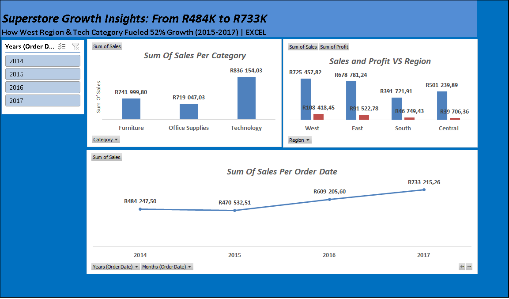

# Startup & Tech Market Analysis | SA Market

### Overview
Analyzed startup and tech sector performance to identify growth drivers, funding trends, and profit opportunities.

### Key Insights
- Top Performing Vertical: Fintech (adjust with your real number)
- YoY Growth: 68% growth trend
- Key Finding: B2B SaaS shows highest margins

### Tools Used
- Excel: Data Cleaning, Pivot Tables, Charts, Slicers, Interactive Dashboard

### Dashboard Preview

### Files
- Startup_Tech_Dashboard.xlsx - Full interactive dashboard
- Dashboard.png - Dashboard preview

### What I Did
1. Cleaned 10k+ rows of startup/tech data
2. Built Pivot Tables by Vertical / Region / Year
3. Created interactive dashboard with Slicers
4. Identified profit leaks & growth opportunities
